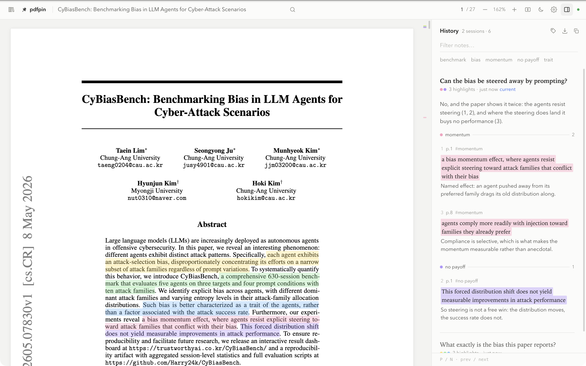

# pdfpin

Read a paper with an AI agent sitting next to you.

You ask a question. The agent reads the PDF, marks the passages that answer it, and writes a short
note on each one. You read the marks in the paper itself, not in a chat window that has lost sight
of the page.



Nothing leaves your machine. The daemon listens on loopback only and your notes sit in plain JSON
beside the path of the PDF they belong to.

## Install

Node 18.17 or newer, on macOS, Windows or Linux. No native build step.

Clone this repository, then:

```bash
npm install
npm install -g .
pdfpin open paper.pdf
```

A guided tour runs the first time. It writes a one-page demo paper, asks it two questions through
the same API an agent uses, and hands the last two steps to you. Re-run it from settings any time.

To let Claude Code drive it, copy `skill/SKILL.md` to `~/.claude/skills/pdfpin/SKILL.md`.

## What an agent does

Read the page text, quote from it, attach a note. One question becomes one session.

```bash
pdfpin open paper.pdf
pdfpin text -p 1-3
pdfpin mark --json '{
  "title": "What evidence backs the speed-up claim?",
  "flow": "Two numbers carry it: the benchmark (1) and the median saving (2). The cost is in (3).",
  "highlights": [
    {"text": "a benchmark of 40 production pipelines", "note": "What it was measured on.", "tag": "setup"},
    {"text": "reduced median wall-clock time by 31%",  "note": "The headline number.",      "tag": "result"}
  ]}'
```

Quote exactly what `pdfpin text` printed. Matching forgives case, whitespace, end-of-line
hyphenation and small typos; a quote that spans two pages does not resolve, so split it. When a
quote is not found the command exits with status 2 and prints the nearest candidates.

A scanned PDF has no text to quote. pdfpin says so rather than pretending the quote was wrong; run
the file through OCR first.

`pdfpin guide` prints the full command reference.

## What you do

| | |
|---|---|
| `⌘D` / `Ctrl+D` | documents: open a PDF, switch between them |
| `⌘J` / `Ctrl+J` | the notes panel |
| `⌘,` / `Ctrl+,` | settings: language, theme, colours, shortcuts |
| `o` | open a PDF through your system's file chooser |
| `←` `→` | turn a page |
| `n` `p` | step through highlights |
| `⌘F` / `Ctrl+F` | search the document |
| `d` · `h` | theme · show or hide highlights |

Every shortcut is rebindable, and settings live on the daemon so all your windows agree.

Click a note to jump to it; click a highlight to read its note. Drag across a sentence to add your
own, and tag it with one of the agent's tags to join that topic. Sessions stack newest first, so a
paper collects a record of everything you asked about it. Old sessions archive rather than delete.

Colour follows the tag, or the session if you prefer one colour per question. A colour the agent
asked for by name is never repainted. The tag manager renames a tag everywhere, recolours it, or
takes it off its highlights.

Export a session as an annotated PDF with real highlight annotations, or as Markdown.

## Where things live

`~/.pdfpin` holds one JSON file per document plus your settings; `PDFPIN_HOME` moves it. Other
environment variables: `PDFPIN_PORT` (default 47831), `PDFPIN_BROWSER=browser` to use your default
browser instead of an app-mode window, `PDFPIN_CHROME` to point at a specific Chromium.

`docs/design.md` explains how a quote becomes a highlight, and why the pieces are arranged this way.

## Develop

```bash
npm test
node bin/pdfpin.js open some.pdf
```

MIT licensed.
